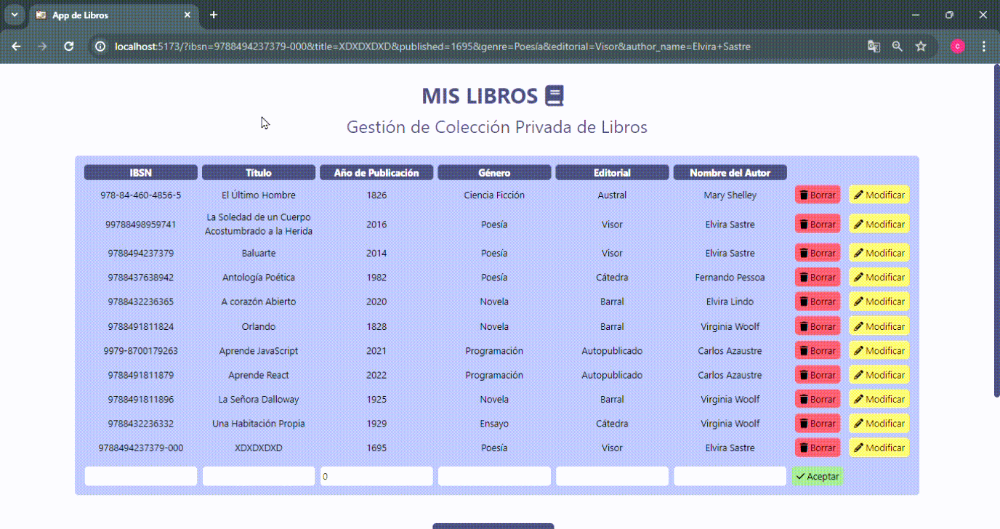
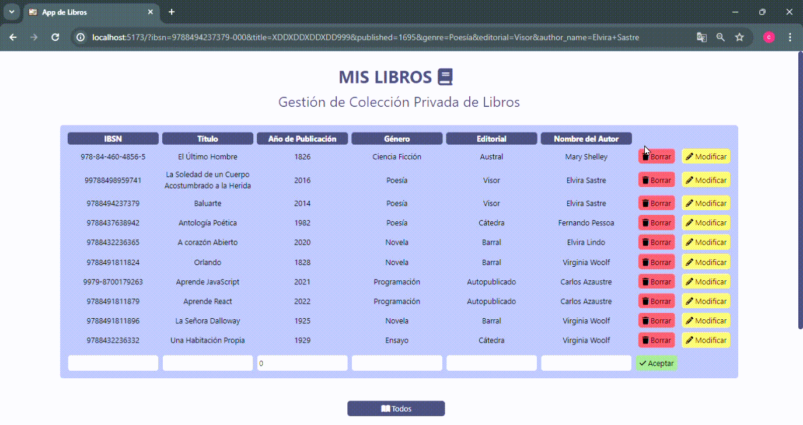

<h1 align="center">Mi APP DE LIBROS</h1>

<h2> 1- Project description:</h2>
  <ul>
    <li>An app that manages a personal and private book collection</li>
    <li>It must have a list of all books containing their ISBN, Title, Publicaton Date, Genre, Editorial and Author Name</li>
    <li>The only user (the books owner) must be able to create a new book, update an existing one, and delete any of them</li>
    <li>The user must be able to filter books by genre, editorial, and author</li>
  </ul>

## 2- Developer

  ### Yours trully:
  
   [Alba Rus](https://github.com/Albaric0que)
  
  <h2> 3- Project Demo</h2> 

  <div style="heigth:auto; display:flex; padding:5rem;">
    <h3 style="align-self: center;">CREAR</h3>
    
    <h3>MODIFICAR</h3>
    
    <h3>BORRAR</h3>
    
    <h3>FILTRAR POR EDITORIAL</h3>
    
    <h3>FILTRAR POR GÉNERO Y AUTOR</h3>
    
  </div>

<h2> 4- Stacks</h2>

* **Frontend:**
  <ul>
    <li>HTML5</li>
    <li>CSS3</li>
    <li>TYPESCRIPT</li>
    <li>QWIK</li>
    <li>TAILWINDS</li>
  </ul> 

* **Backend:**
  <ul>
    <li>MONGODB</li>
    <li>PYTHON</li>
  </ul>
  
* **Other tools:**   
  <ul>
    <li>DOCKER</li>
    <li>VISUAL STUDIO CODE (IDE)</li>
    <li>GIT</li>
  </ul>

<h2> 5- To install this project</h2>
  <li>You will need to install DOCKER in your computer</li>
  <li>Open your Terminal and go to a direrctory of your choice</li>
  <li>
    To clone the project, run:
    
  ```bash  
   git clone https://github.com/Albaric0que/proyecto_servidor.git
  ```  
  </li>
  <li>Once the project is cloned, navigate to the directory that contains the docker-compose.yml file and open your terminal</li>
  <li>Iniciate Docker with the comand docker-compose up</li>
  <li>Open a tab in your browser and go to localhost:5173. You will visualize the app there</li>
  <li>Qwik is a JavaScript framework that natively renders HTML server-side (SSR) to optimize performance </li>

<h2> 6- Next Steps</h2>
<ul>
  <li>Improving styles and user experience</li>
  <li>
    <ul>Scalating the app including:  
      <li>Adding collections and complexity to the database</li>
      <li>Dividing the proyect into more components</li>
      <li>Diving further into the possibilities that Qwik offers as a paradigma changing framework</li>
    </ul>
  </li>
</ul>


